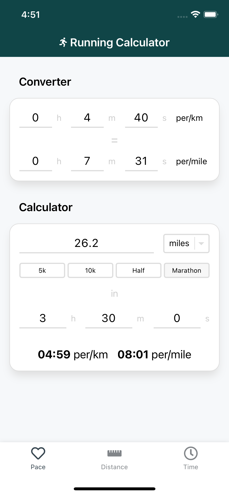
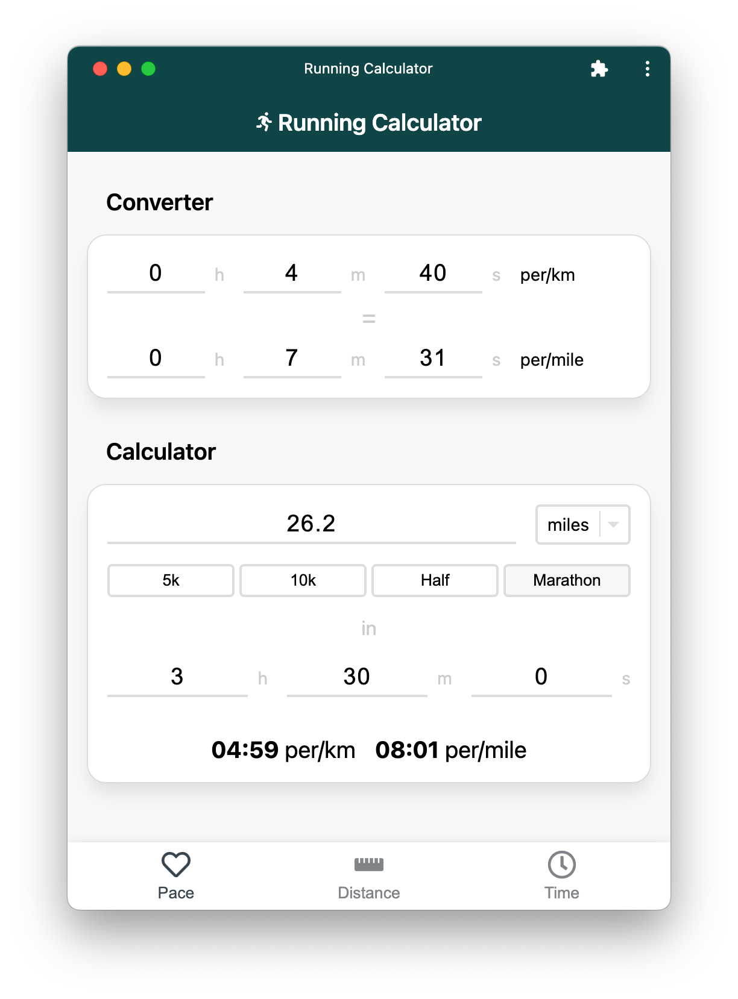

# Running Calculator

_The calculator swiss-army knife for runners_

Progress Web Application (PWA) which provides you with the ability to calculate running pace, time and distance, along with common-place imperial/metric measurement conversion.

The application has been built using the following technologies:

- React
- TypeScript
- CSS-in-JS (styled-components)
- Vite

## Usage

### Mobile

  

### Desktop

 
